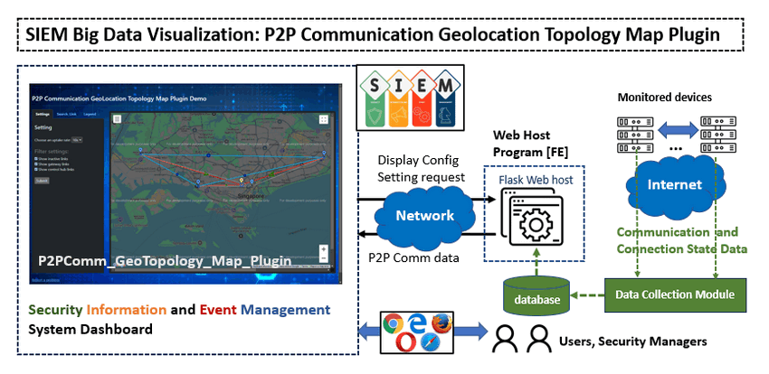
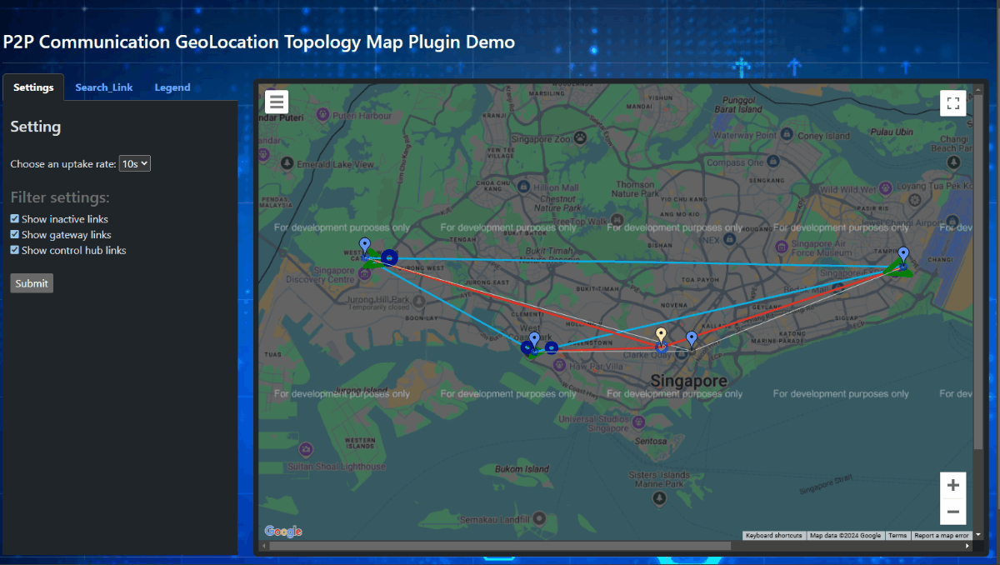
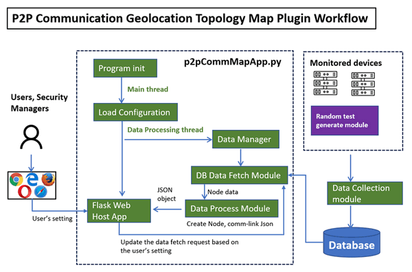
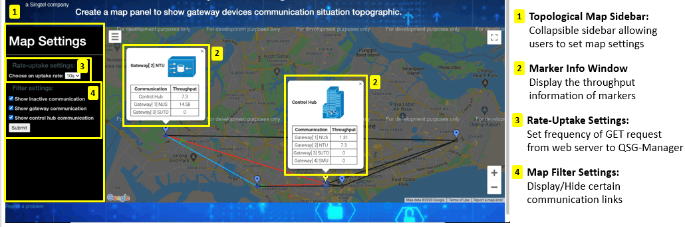

# P2PComm_GeoTopology_Map_Plugin



**Program Design Purpose**: The goal of this project is to develop a Flask-based web App plugin that can be integrated into a Security Information and Event Management (SIEM) system. This plugin is designed to visualize real-time peer-to-peer (P2P) communication status within a distributed system. Key metrics such as data flow throughput between encrypted devices and data transmission speed between servers and clients will be displayed alongside the network topology on an interactive geolocation map. This visualization will enable security administrators to effectively monitor, analyze, and manage real-time P2P communication states, helping to identify potential performance bottlenecks, latency issues, and abnormal communication patterns across the distributed network.

```python
# Version:     v0.2.1
# Created:     2020/05/22
# Copyright:   Copyright (c) 2024 LiuYuancheng
# License:     MIT License 
```

**Table of Contents**

[TOC]

------

### Introduction

The P2PComm_GeoTopology_Map_Plugin is a Flask-based web application designed to visualize real-time peer-to-peer (P2P) communication diagrams and network topology over an interactive geolocation map. By leveraging the Google Maps API, this plugin delivers a dynamic and intuitive user experience, featuring fully customizable configuration settings and an all-in-one HTML webpage which can be easily integrate in other into Security Information and Event Management (SIEM) systems to make it a valuable addition for monitoring and managing distributed network communications. The Web plug UI is shown below:




This tool can help the security administrators with enhanced capabilities to monitor and analyze distributed system communications. It provides insights into key metrics such as:

- **P2P Device Data Flow Throughput**: Visualizes the transmission rate and data volume exchanged between encryption devices.
- **Data Transmission Speed**: Tracks connection state, latency between servers, clients, and other network nodes.
- **Network Topology**: Dynamically maps peer-to-peer relationships and data exchange paths.
- **Geolocation Mapping**: Displays the physical locations of nodes and their communication links over an interactive map interface.

#### System Main Components Introduction

The project is structured into three main components:

1. **GeoTopology_Map Front-End Application**: A Flask-based front-end module that integrates with the Google Maps API to render an interactive map for real-time visualization.
2. **Backend Data Database**: A lightweight SQLite3 database backend to store and manage device communication data, making it accessible to the web application.
3. **Data Collection Module**: An interface program that gathers communication data from devices and updates the database in real time.

These components form a system for visualizing and managing P2P communication and network topology, enhancing situational awareness and network security analysis. For the plugin demo, please refer to this video:


------

### System Design

The system workflow diagram is shown below:



The system includes four function modules:

**Flask Web Host Application** 

- **Function**: Hosts the web interface and serves data to the user.
- **Key Features**: Interactive map visualization using Google Maps API,  User-configurable settings for customizing the displayed topology and Real-time data updates based on user setting.

**Data Management Module**

- **Purpose**: Coordinates the overall workflow and integrates different modules.
- **Key Features**: Loads initial configurations (e.g., database connections, API keys),  Manages data threads for processing and communication, Queries the database for the latest node and link data and Creates JSON objects for nodes and communication links.

**Database**

- **Function** : store the Node metadata (e.g., device IDs, geolocations) and Node metadata (e.g., device IDs, geolocations). Two table are included with below config:

```sqlite
CREATE TABLE IF NOT EXISTS gatewayInfo(id integer PRIMARY KEY, name text NOT NULL,ipAddr text NOT NULL,lat float NOT NULL,lng float NOT NULL, actF integer NOT NULL, rptTo integer NOT NULL,type text NOT NULL)
```

```sqlite
CREATE TABLE IF NOT EXISTS gatewayState(time float PRIMARY KEY,id text NOT NULL, updateInfo text NOT NULL)
```

**Data Collection Module**

- **Function** : Gathers data from monitored devices and updates the database.
- 


There is also a sidebar attached beside the map which allow users to decide various map settings. They can choose the data update rate of the flask webserver calling GET request through a dropdown menu. A filter function is also added to only display certain types of communication links (active, gateway, control hub).


------

### Program Setup

###### Development Environment 

Python3.7.4, HTML+flask, socketIO+eventlet, SQLite3

###### Additional Lib/Software Need

1. **python Flask** : https://www.fullstackpython.com/flask.html

   ```
   Installation cmd: pip3 install Flask
   ```

3. **flask-socketIO 4.5.1**: https://flask-socketio.readthedocs.io/en/latest/

   ```
   Installation cmd: pip3 install flask-socketio
   ```

4. **SQL Browser**: https://sqlitebrowser.org/blog/version-3-12-2-released/

4. **python eventlet**: https://pypi.org/project/eventlet/

   ```
   pip3 install eventlet
   ```

5. --

###### Hardware Needed : None

###### Program Files List 

version: v0.2

| Program File             | Execution Env | Description                                                  |
| ------------------------ | ------------- | ------------------------------------------------------------ |
| src/topologyMapHost.py   | python3       | This module is used create flask webserver to send GET request with the QSG-Manager. |
| src/globalVal.py         | python3       | This module stores all the global variables used in the flask webserver. |
| src/node_database.db     |               | Database file.                                               |
| src/databaseCreater.py   |               | Module to insert the simulation data into the data base.     |
| src/Log.py               |               | Log generation mode.                                         |
| src/NodesRcd.txt         |               | File to save simulation node information.                    |
| src/ConfigLoader.py      | python3       | Module to load the node record file.                         |
| src/templates/index.html | HTML          | This file generates the UI of the Topological Maps using Google Maps. |
| src/static/js/maps.js    | JavaScript    | This module stores the static JS functions to run the Google Map. |
| src/static/css/map.css   | CSS           | This is the stylesheet for the Topological Map.              |
| src/static/img           |               | Image file used by the web page.                             |


------

### Program Usage

###### Program Execution Cmd 

1. Start up the data insert simulation program to add new gateway 
   ```
   python3 databaseCreater.py
   ```

   Module API Usage: call `updateStateTable(self, gatewayID, infoStr)` to insert the new gateway state in to database.
   
2. Run the flask webserver to retrieve data from the QSG-Manager

   ```
   python3 topologyMapHost.py
   ```

   **After running step2, wait 30 sec make sure the database thread fully started then do step 3.**

3. Open web browser and enter URL: http://127.0.0.1:5000


###### Web Page Usage




------

### Problem and Solution

###### Problem[0] **:** Unable to run flask server and socketIO concurrently due to threading issues

**OS Platform** : Windows

**Error Message**: greenlet.error: cannot switch to a different thread

**Type**: Setup exception

**Solution**:

Upgrade Python 2.7 to Python 3.x to run Eventlet successfully. Alternatively, use gevent and gevent-socket library instead of eventlet:

- Step 1: Uninstall eventlet library: pip3 uninstall eventlet
- Step 2: Install gevent: pip3 install gevent
- Step 3: Install gevent-socket: pip3 install gevent-socket


------

### Reference Link

- N.A

  

------

> Last edit by LiuYuancheng(liu_yuan_cheng@hotmail.com) at 08/12/2021